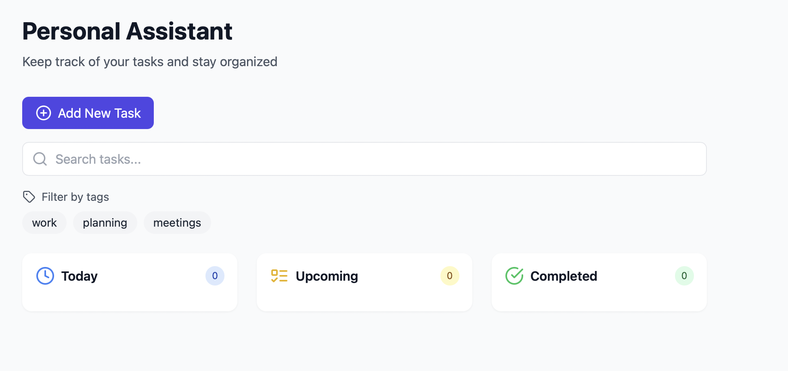
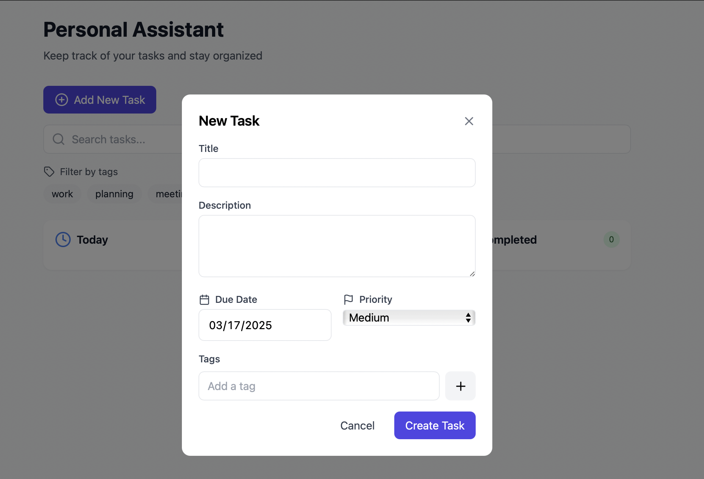

# TaskManager

## Overview
TaskManager is a tool designed to help users organize and manage their tasks. It provides features such as task creation, assignment, and tracking progress.

## Features
- Task creation and assignment
- Progress tracking

## Getting Started

### Prerequisites
- Node.js (version 14.x or higher)
- npm (version 6.x or higher)

### Installation
1. Clone the repository:
    ```sh
    git clone https://github.com/saikongara/TaskManager.git
    ```
2. Navigate to the project directory:
    ```sh
    cd TaskManager
    ```
3. Install the dependencies:
    ```sh
    npm install
    ```

### Running the Application
To start the application locally, run:
```sh
npm run dev
```
The application will be available at `http://localhost:3000`.

#### Application Interface
Once the application is running, you will see the main interface as shown below:



- **Add New Task**: Click this button to create a new task.
- **Search tasks**: Use this search bar to find specific tasks.
- **Filter by tags**: Filter tasks based on tags like work, planning, meetings, etc.
- **Task Status**: View tasks categorized under "Upcoming" and "Completed".

#### Creating a New Task
To create a new task, click on the "Add New Task" button. A form will appear as shown below:



- **Title**: Enter the title of the task.
- **Description**: Provide a detailed description of the task.
- **Due Date**: Set the due date for the task.
- **Priority**: Select the priority level (e.g., Low, Medium, High).
- **Tags**: Add relevant tags to categorize the task.

After filling out the form, click "Create Task" to add the task to your list.

### Running Tests
To run the tests, use:
```sh
npm test
```

## Contributing
We welcome contributions to improve TaskManager. To contribute, follow these steps:
1. Fork the repository.
2. Create a new branch:
    ```sh
    git checkout -b feature/your-feature-name
    ```
3. Make your changes and commit them:
    ```sh
    git commit -m "Add your message here"
    ```
4. Push to the branch:
    ```sh
    git push origin feature/your-feature-name
    ```
5. Create a pull request.


## Contact
For any questions or feedback, please contact [saikongara](https://github.com/saikongara).
